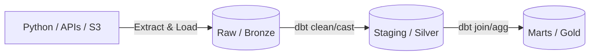

# Urban Mobility Context Engine (NYC)


This project is an end-to-end data engineering pipeline designed to build a "Context Engine" for analyzing Citibike ridership in New York City[cite: 1]. The pipeline ingests chaotic, disparate urban data streams—from raw Socrata APIs to geospatial polygons—and instills analytical order, creating a final, analytics-ready data product that explains the "why" behind daily and hourly mobility patterns[cite: 1].

---

## Tech Stack & Architecture

This pipeline is built on a modern, local-first ELT framework utilizing a **Medallion Architecture**[cite: 1].

| Category | Technology |
| :--- | :--- |
| **Orchestration** | **Apache Airflow** |
| **Containerization** | **Docker & Docker Compose** (Custom Image) |
| **Database** | **PostgreSQL + PostGIS** |
| **Transformation** | **dbt Core** |
| **Ingestion** | **Python (OOP, GeoPandas, Boto3, PyArrow)** |

### The Data Flow (ELT)



1.  **Extract & Load (EL):** Idempotent Python ingestor classes, orchestrated by Airflow via logical execution dates, fetch data from various sources and load it into a **Bronze** `raw` schema in Postgres[cite: 1].
2.  **Transform (T):** `dbt` runs all downstream transformations[cite: 1]:
    * **Silver 🥈:** `staging` models that clean, standardize types, and enforce data quality tests[cite: 1].
    * **Gold 🥇:** Final, denormalized `marts` tables (Star Schema) that join all context layers into a single pane of glass[cite: 1].

---

## Deep Dive: Geospatial & Weather Engineering

Rather than relying on static, generalized weather data for the entirety of New York City, this pipeline implements highly localized geospatial processing to map atmospheric conditions directly to specific boroughs and neighborhoods.

### 1. Shapefile Ingestion & PostGIS Integration
The spatial foundation is built using the 2020 NYC Neighborhood Tabulation Areas (NTA) shapefiles. The `shapefile_setup.py` script leverages `GeoPandas` and SQLAlchemy to read the `.shp` assets and write the raw geometries directly into a PostGIS-enabled database utilizing the native `to_postgis()` method[cite: 1].

### 2. Dynamic Centroid Extraction
To achieve micro-climate accuracy, the `WeatherIngestor` dynamically calculates the geometric centroid of every single NYC neighborhood polygon. Because the source shapefiles use a local projected coordinate system, the script reprojects the geometries to WGS 84 (EPSG:4326) on the fly to extract accurate latitude and longitude coordinates for the API payload[cite: 1].

### 3. Asynchronous Rate Limiting & Staging
Fetching hourly data for over a hundred neighborhood centroids over historical timeframes requires strict traffic control. 
* **Traffic Shaping:** The ingestor mathematically paces requests to stay under Open-Meteo's 5,000 calls/hour threshold, implementing a rolling cost tracker, a 4-second delay between calls, and automatic hour-long sleep cycles if limits are approached[cite: 1].
* **Optimized I/O:** Instead of bombarding the database with constant `INSERT` statements, the ingestor aggregates the API responses into memory, saves them locally as Snappy-compressed Parquet files via `PyArrow`, and executes massive bulk loads into PostgreSQL in chunks of 100,000 records[cite: 1].

---

## Data Sources

| Context Layer | Data Source | Ingestion Method |
| :--- | :--- | :--- |
| **Core Activity** | Citi Bike Trip Data | Python (Boto3 from S3) |
| **Weather** | Open-Meteo Archive | Python (GeoPandas Centroid Mapping) |
| **Events** | NYC Permitted Events | Python (Generic Socrata API Ingestor) |
| **Infrastructure** | NYC 311 Service Requests | Python (Generic Socrata API Ingestor) |
| **Temporal** | NYC Holidays | `dbt seed` (from CSV) |
| **Geospatial** | NYC Neighborhoods (NTA) | Python (`GeoPandas` to PostGIS) |

---

## Local Development & Quick Start

The entire pipeline—including the database, geospatial dependencies (GDAL/libgdal), and orchestration engine—is fully containerized[cite: 1].

**1. Clone the repository and configure credentials**
```bash
git clone [https://github.com/shitiwa10/nyc-data-pipeline.git](https://github.com/shitiwa10/nyc-data-pipeline.git)
cd nyc-data-pipeline
cp .env.example .env  # Update with your desired database credentials
```

**2. Build the custom Airflow environment**
Because the pipeline requires complex geospatial libraries (`geopandas`, `postgis`), the `docker-compose.yml` builds a custom image tailored for spatial ELT.
```bash
docker-compose build
```

**3. Launch the infrastructure**
```bash
docker-compose up -d
```

**4. Trigger the Pipeline**
Navigate to `http://localhost:8080` (admin/admin). The Airflow scheduler will execute the end-to-end `nyc_context_engine_monthly_ingestion` DAG, running the Python EL scripts first, followed immediately by the `dbt build` command to generate the Silver and Gold models.